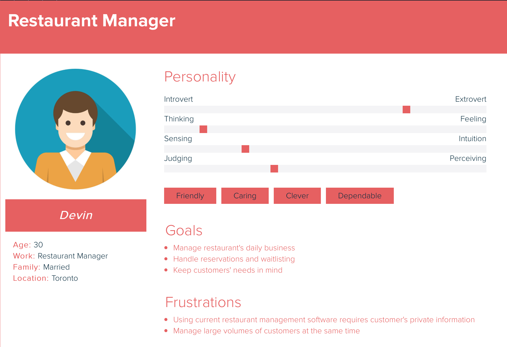
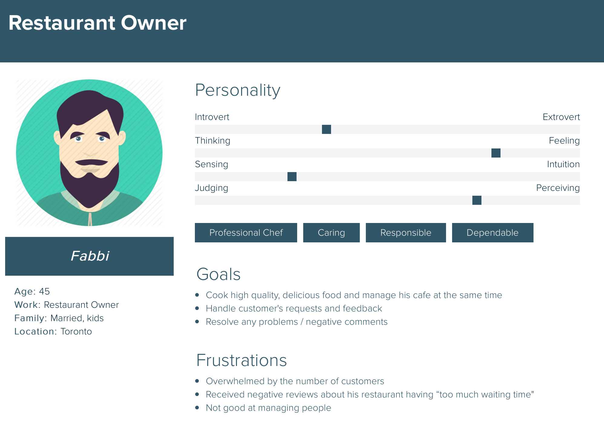
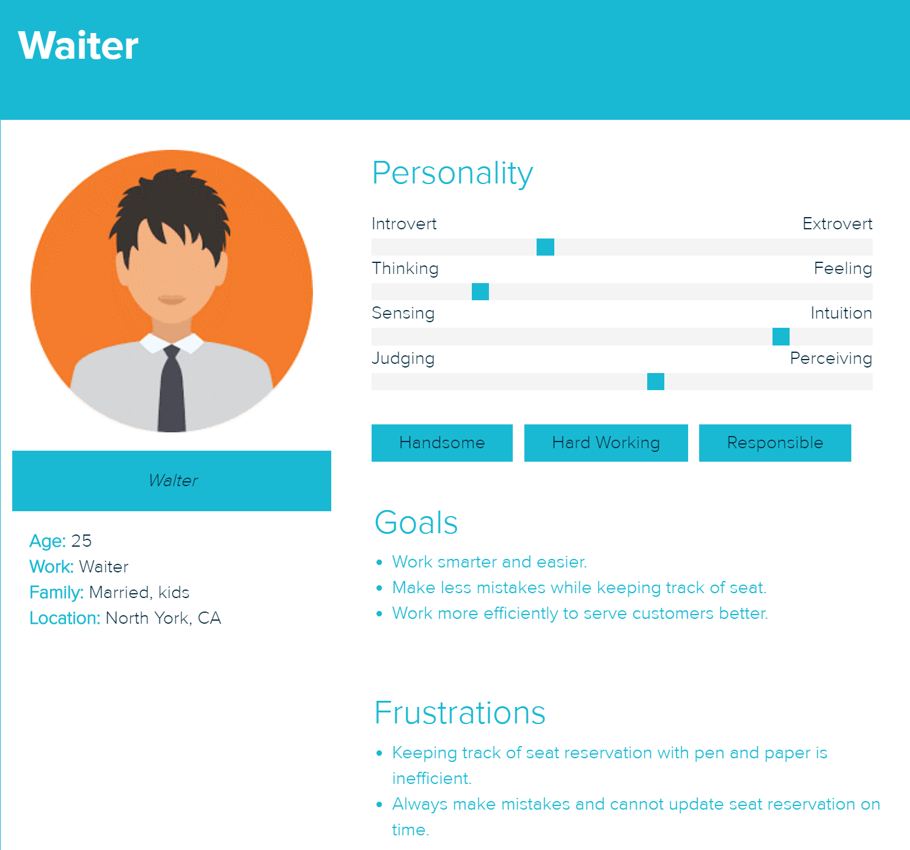

# Table Ready
Team #5

## Product Details
 
#### Q1: What are you planning to build?

We are planning to build a web portal for [Table Ready](http://www.tableready.net) that allows restaurant owners to efficiently manage their restaurants’ waitlist and reservations, customers, and employees with ease. The clients register and manage their restaurant internally, such as reservations and nightly seating, and externally, such as advertising restaurant, while maintaining positive interactions with new and returning customers. In addition, our portal will integrate with another app that customers use to make reservations.

There are applications like [yelp](https://www.yelp.ca) that solve external problems and there are applications like [opentable.com](opentable.com) that solves internal problems. We want to build a website that does both. Our platform has three levels of users: admin, restaurant manager, and employees. 
   * Admin has the highest authority, it manages all the user information and status. 
   * Restaurant owner registers on our website and posts their restaurant information (menu, location, operating hours)  to the public. Additionally, our system will support bill tracking (payments for this service) and nighty seating management. 
   * For employees, they must be created by the restaurant managers to join a restaurant and then has access to its seating and communication to customers.

#### Q2: Who are your target users?

Our target audiences are restaurant owners who need reservations and seating charts for managing their customers and employees while trying to advertise their restaurants. 
Consider the following personas:
1. Devin is the manager of *This is So Delicious Restaurant* at north york. He uses restaurant management software to handle reservations and waitlisting, but they all require the customers to provide private information so he gets a lot of complaints. 
2. Fabbi is the owner of *This is So Famous Cafe* at downtown toronto. Since his food is so delicious, there is always a long waitlist for his restaurant. He is overwhelmed by the number of customers and negative reviews about his restaurant having “Too much waiting time”. Fabbi is a good cook but not a good manager, so he does not have a proper restaurant management tool. Therefore, he desperately needs a new management system for his restaurant to solve this problem.
3. Walter is the waiter of *This is Very Famous Cafe*. He is having a hard time dealing with the numerous of customers they have each day. Right now he is using pen and paper to keep track of all the available seats. However, this is really inefficient and he often make mistakes when writing them down on paper.

#### Q3: Why would your users choose your product? What are they using today to solve their problem/need?

With our web portal, restaurant owners will be able to manage reservations, wait lists and manage nightly seating, making it easier for them to have positive interactions with customers.

Many similar products exist. For example, [opentable.com](opentable.com) also provides restaurant reservations. However, our restaurant management web portal is trying to help the restaurant managers, while working with the customers’ mobile app in the backend to deliver a series of convenience for restaurant owners and customers. Management with ease and efficiency is our partner Table Ready’s goal. In addition, unlike most of the existing product, our app does not require users to register using their private information (phone numbers, email address, etc). This way, we can perform similar tasks without taking their private information so that the user feels secure. 

#### Q4: How will you build it?

![alt text][architecture diagram]

[architecture diagram]: ./docs/architecture.jpg "architecture.jpg"

We will build the web portal using `NodeJS` with `express` framework for the backend and `JavaScript` with `React` library for the frontend. For UI design we will use the `Bootstrap ` library and `Material` UI library.
For storing data, we will use a SQL database, `mySQL`, which will be connected with the nodejs server. This database server is already set up and we are planning to use the existing server instead of making a new one.
We will deploy our web application on the server used by table ready. 
We are still researching whether using the existing SQL database is the best solution, as we’ve been having technical difficulties that are out of our capabilities. If it is a very hard process, we will instead use `MongoDB` Atlas, a third party application and its provided API to connect to its database with Nodejs.
For testing purposes, we will mock data corresponding to our data model to database and write unit tests or use testing frameworks (e.g., `mocha`) to verify the correctness of each functionality.

#### Q5: What are the user stories that make up the MVP?

User Stories:
      1. As an owner of this website, I want to delete information that users posted and have the ability to ban users in order to keep inappropriate information and unwanted user off my website. Additionally, I want to manage all clients, logins, employees, billing, and other issues for support.
      2. As a newly opened restaurant owner. I want to share my restaurant information online in order to gain popularity.
      3. As a busy owner, I want to run an analysis of today’s seating information in order to evaluate daily performance.
      4. As an employee of a restaurant, I want to manage daily seating for wait list and reservations.
      5. As a hungry customer, I want to find a nearby restaurant with an affordable price that has no waitlist in order to have a quick meal.

Acceptance Criteria:
- The acceptance criteria for the owner of this website is:
    - Ability to get information about all the users
    - Ability to add/remove users from the system.
    - The information from the users includes:
        - Their restaurant’s information
        - Their login/logout activity information

- The acceptance criteria for a newly opened restaurant owner is:
    - Ability to advertise my restaurant using this platform
    - The information I should be able to upload is:
        - The restaurant's name
        - The restaurant's location
        - The restaurant’s menu
        - The restaurant’s opening hours
        - The type of the restaurant (sushi, burger, etc)

- The acceptance criteria for a busy restaurant owner is:
    - Ability to tell customers the busiest hour of my restaurant
    - Ability to allow customers to waitlist my restaurant
    - Ability to run an analysis on my performance for the day
    - The information I should be able to upload/get is:
        * The overall statistic of the restaurant (how many guests, net income, etc)
        * Request from guest if they want to waitlist
        * As an employee of the restaurant, my acceptance criteria will be:
        * Ability to remove customer from waitlist when there are space available
        * Ability to remove customer from occupied seats when they left
        * Ability to upload bills

- As a hungry customer, my acceptance criteria will be:
    * Ability to get information about different restaurant
    * Ability to know how busy a restaurant is
    * The information I should be able to get is:
        * The restaurant’s general information (location, menu, price, rating, etc)
        * How many people are on the waitlist (if there is one)

----

## Process Details

#### Roles & responsibilities

There will be one person who will be the project manager, he/she will be responsible for the client side of this project (e.g., schedule weekly meetings with the client, make sure project is on the right track..). Other roles including front-end developer, back-end developer, as well as database designer and developer. Each of our group members will likely be focusing on at least two roles. 

* Xiaohe Gong:
    * Weakness: familiar but rarely used Java, no experience with react and angular 
    * Strength: experienced with web dev, docker, and database
    * Responsibilities: working on connecting frontend with backend, planning milestones, and application deployment.
* Jiatao Xiang:
    * Weakness: no experience with angular
    * Strength:  database design, backend design, front end design
    * Responsibilities: database design/backend/front-end        
* Yujie Miao: 
    * Weakness: not familiar with React and Angular.  Not familiar with UI design.
    * Strength: proficient with php, very experienced with web development using javascript and sql database.
    * Responsibilities: Database design, back-end.
* Xu Wang:
    * Weakness: unfamiliar with NoSQL
    * Strength: experience with backend development, database design and management
    * Responsibilities: backend development and front-end design and implementation
* Huakun Shen:
    * Weakness: unfamiliar with frontend UI design
    * Strength: experience with databases, and frontend & backend web development
    * Responsibilities: app deployment on AWS, backend
* Wenshuo Li:
    * Weakness: No web/database experience
    * Strength: experienced with UI design
    * Responsibilities: Front-end design, implementation
* Lantao Cui: 
    * Weakness: No knowledge of database, React and angular
    * Strength: Familiar with Java, Javascript, and has experience with UX design
    * Responsibilities: Back-end and front-end design, implementation.
    
#### Team Rules

We expect to meet once per week. We will have face-to-face meetings within our team, and we will have remote meetings on google hangout with our partner since our partner does not live in the GTA. We’ve already set up a groupchat with our partner for meeting remotely. 

For meetings, we will keep a minutes for every meeting. We will also keep track of our progress on our [Trello board](https://trello.com/b/mTQ6buKm/phase-1). 
We have not had a lot of problems since we are all friends with each other. We’ve been indecisive about which kind of database system we want to use, so we wrote down the advantages of each decision and took a vote. We had some confusion for the technical expectations of our partner about what she wants the application to be deployed on, so we had another meeting with her to clarify and we are planning to talk to our TA about some technical problems we may face. If any tasks are delayed, we will talk to the person that was assigned the task and help them if they are stuck. If they are behind schedule due to other reasons (other assignments or being lazy), we will discuss the problem further in our weekly meeting.

#### Events

We plan to hold meetings weekly with our team at Gerstein Library, and at least bi-weekly with our partner remotely using Google Hangout. We’ve temporarily set the meeting time to be every Saturday morning.
For each meeting, we are going to talk about our progress and plans. We will show our partner what we’ve been doing this week. We will also ask our partner for further instructions and suggestions, and we need to assign additional work to people with less work or more available time. We will have a discussion session and multiple code reviews. Considering the case that someone may not be clear about what they should do, we decide to divide our group in pairs, so that the team management will be more flexible because we can have pair meetings more frequently.   
Besides from regular meetings with our partner, we will also hold regular meetings within the group (1 to 2 times per week). During the group meeting, each member will talk about what they’ve been doing this week, what they’ve finished and what they are planning to do next.

#### Partner Meetings
We’ve already had two meetings online. One on October 4th and one on October 12th. During our first meeting, we introduced ourselves to our project partner. The project partner briefly explained what the project is and what her expectation is about this project. In the second meeting, we talked about how should we build this project and what specific architecture should the application follow. We had a long discussion on which type of database we are going to use (SQL or no-SQL). 
So now we have the regular meeting, basic technologies and architecture set up with our partner. 
We've been keeping track of the meeting minutes [here](https://docs.google.com/document/d/144cCnsJGDXGZDuQeKfe_9Xnur8x1ENCg_WSGpzylNng/edit?usp=sharing).

#### Artifacts

We will have a To-Do lists including all of our current tasks. We will use trello to assign tasks for our project. We will update what we should do for each week and cross out the items we’ve already finished. 
- Phase 1 [Trello board](https://trello.com/b/mTQ6buKm/phase-1)

Each task will have its own priority, and we will be focusing on the one will higher priorities. We will prioritize each task based on whether it is a prerequisite of other tasks, for example, if we must finish task A before task B, task A will have a higher priority. We will also evaluate one task’s priority based on how many other tasks it is involved in. When assigning tasks to group members, we will take account into the task’s difficulty, that particular member’s strength and weakness. After all, we will make sure each group member put an equal amount of time and effort into this project.

----
### Highlights
1. What language to be used for backend?

   - Decision: Nodejs with express framework.

   - Reasoning: 
   Some other alternatives we considered were PHP and Python flask. We decided to use NodeJS because all of our team members have learnt or will finish learning CSC309 which is a Web Programming course teaching NodeJS this semester. We all will have proficiency in NodeJS while programming the web app.

2. What database to be used (SQL or NoSQL)?

   - Decision: SQL

   - Reasoning:
   We are somewhat experienced with SQL and very experienced with no SQL database system like MongoDB, but as requested by our partner, she only wants the application to be run locally using SQL.  

3. What language/framework to be used for frontend?

   - We temporarily decide to use React as our frontend framework. 

   - Reasoning: 
   It’s a very handy framework that provides virtual DOM and component creation services for the developer, which make the development process a lot easier and much more efficient. Also, it’s easy for beginners to start from scratch, so that our team can get working with it in a very short time.